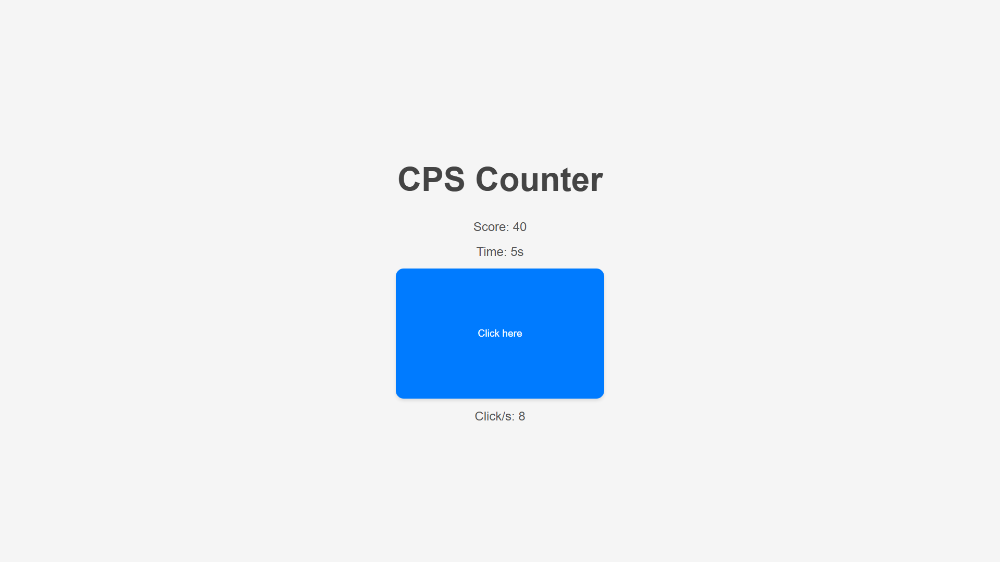

# CPS Counter

## Description
This project is a simple CPS (Clicks Per Second) counter application. It allows you to measure how many clicks you can make in a second.

## Features
- Measure clicks per second
- Display the current CPS value
- Reset the counter

## Screenshot

